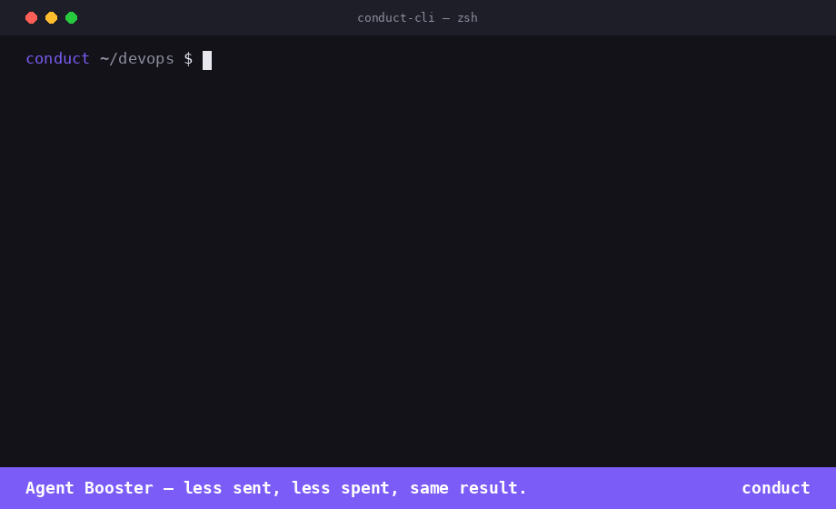
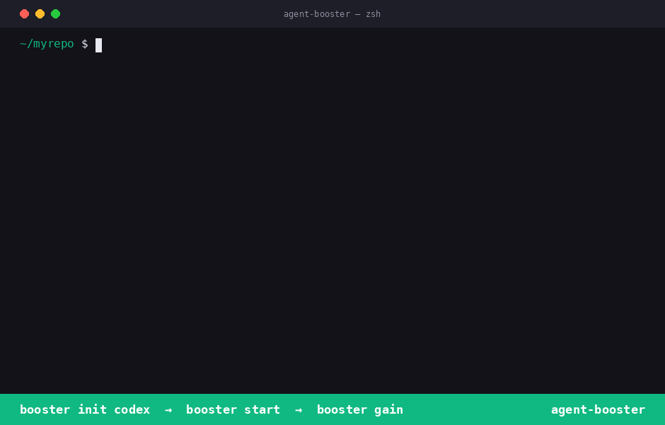

# Agent Booster

Cut AI coding agent token costs 5–15x by routing only the code that matters.

Instead of sending full source files to the model on every read, Agent Booster builds a symbol index of your codebase and returns only the functions and classes relevant to the current task.



---

## How it works

```
Without Booster                    With Booster
─────────────────                  ────────────────────────────
Read executor.py                   smart_read executor.py + task
→ 1,881 lines (~6k tokens)         → 3 matching functions (~200 tokens)
```

Five layers work together:

| Layer | What it does |
|---|---|
| **Symbol index** | tree-sitter parses every `.py`, `.ts`, `.tsx`, `.js`, `.jsx` file, extracts functions/classes into SQLite |
| **Vector embeddings** | sentence-transformers encodes each symbol for semantic search |
| **Smart read** | given a file + task, runs per-file vector search and returns only matching symbol line ranges |
| **MCP server** | exposes four tools over stdio — any MCP-compatible agent can call them |
| **Platform init** | one command writes the right config for Claude Code, Cursor, Windsurf, or Codex |

---

## Installation

Requires Python 3.10+.

```bash
pip install agent-booster          # symbol index + MCP tools
pip install agent-booster[embed]   # + semantic vector search (recommended)
```

---

## Quickstart

**Step 1 — Wire up your AI tool**

```bash
booster init claude     # Claude Code
booster init cursor     # Cursor
booster init windsurf   # Windsurf
booster init codex      # OpenAI Codex CLI
booster init all        # all four
```

Each command shows exactly what files will change, asks for confirmation, then writes them. Fully reversible:

```bash
booster remove claude   # or cursor, windsurf, codex, all
```

Example — wiring up OpenAI Codex (`booster init codex` → `booster start` → `booster gain`):



> **Run once per project, not once per session.**
> The hooks live in `.claude/settings.json` and `.mcp.json` at the project root.
> Every Claude Code session opened in this directory — any terminal window, same machine — picks them up automatically.
> No per-session setup needed.

**Step 2 — Index your codebase**

Run once from your project root. Re-run after large refactors.

```bash
booster index && booster embed
# Indexed 260 files, 1800 symbols.
# Built embeddings for 1800 symbols.
```

The index is stored at `.booster/` (gitignored). The index is shared across all sessions.

**Step 3 — Restart your AI tool**

The `agent-booster` MCP server is now available in every session. Claude Code (and other tools) will use `smart_read` and `search_context` automatically on indexed files.

**Step 4 — Track savings**

```bash
booster gain
```

---

## CLI reference

### `booster init <platform>`

Writes the MCP server config and rules file for the target platform. Asks for confirmation before making any changes.

```bash
booster init claude     # .mcp.json + CLAUDE.md + .claude/settings.json hook
booster init cursor     # .cursor/mcp.json + .cursorrules
booster init windsurf   # ~/.windsurf/mcp.json + .windsurfrules
booster init codex      # ~/.codex/config.json + AGENTS.md
booster init all        # all four

booster init claude --yes   # skip confirmation (CI/scripts)
```

### `booster remove <platform>`

Cleanly undoes everything `init` wrote. No residue.

```bash
booster remove claude
booster remove cursor
booster remove windsurf
booster remove codex
booster remove all
```

### `booster index`

Scans all `.py`, `.ts`, `.tsx`, `.js`, `.jsx` files from the current directory. Extracts functions, classes, methods, and interfaces into `.booster/symbols.db`. Skips `node_modules`, `.venv`, `__pycache__`, `.git`, `.booster`, `.next`, `dist`, `build`.

```bash
booster index
# Indexed 260 files, 1800 symbols.
```

### `booster embed`

Builds sentence-transformer vector embeddings for all indexed symbols. Required for semantic `search_context` calls. Uses `all-MiniLM-L6-v2` (local, no data leaves your machine).

```bash
booster embed
# Built embeddings for 1800 symbols.
```

### `booster search "<query>"`

Keyword search across all indexed symbols. Returns file path, line number, kind, name, and signature.

```bash
booster search "guard install"
# apps/web/src/app/settings/modules/page.tsx:99  function handleInstall  function handleInstall() {
```

### `booster route "<task>"`

Recommends `haiku`, `sonnet`, or `opus` based on task complexity — keyword signals, file count, and symbol count.

```bash
booster route "fix the guard SSE role check"
# haiku  (narrow task — 0 symbol(s) in 1 file)

booster route "refactor the entire runtime compiler and DSL layer"
# opus  (matches complexity keywords)
```

### `booster serve`

Starts the MCP server over stdio. Called automatically by Claude Code, Cursor, Windsurf, and Codex when configured via `booster init`. You rarely need to run this directly.

### `booster gain`

Shows token savings from past `smart_read` calls — total reads, tokens served vs. tokens saved, savings rate, and top files by savings.

```
Agent Booster — Token Savings Report
─────────────────────────────────────
Active days:        3
Total reads:        47
Tokens served:      12,400
Tokens saved:       89,200
Savings rate:       88%

Top files by savings:
  executor.py              18,400 tokens saved  (12 reads)
  guard.py                 14,200 tokens saved  (8 reads)
```

---

## MCP tools

Once `booster serve` is running, these four tools are available to the agent:

### `get_symbols(file)`

Returns all indexed symbols for a file — name, kind, line range, and signature. No file read required.

```
Input:  { "file": "apps/api/app/runtime/executor.py" }
Output: function run_workflow (lines 42-89): def run_workflow(...)
        class WorkflowState (lines 91-140): class WorkflowState:
```

### `search_context(task)`

Semantic vector search across all symbols in the index. Returns top 10 matches by cosine similarity. Falls back to keyword search if embeddings haven't been built.

```
Input:  { "task": "guard install uninstall" }
Output: apps/web/src/app/settings/modules/page.tsx:99 function handleInstall — function handleInstall() {
        apps/web/src/components/guard/GuardNav.tsx:13 function GuardNav — function GuardNav() {
        ...
```

### `smart_read(file, task)`

Runs per-file vector search and returns only the source lines for matching symbols, with a header showing name and line range. If no symbols match, returns an explicit message so the model knows to fall back to a full Read rather than silently receiving the whole file.

```
Input:  { "file": "apps/api/app/runtime/executor.py", "task": "execute output block" }
Output: # function _execute_output (lines 1165-1210)
        def _execute_output(block, state, credentials, ...):
            ...
```

### `route_model(task, files?)`

Recommends `haiku`, `sonnet`, or `opus` based on task complexity signals. If `files` is omitted, auto-detects via `search_context`.

```
Input:  { "task": "fix the login redirect bug" }
Output: { "model": "haiku", "reason": "narrow task — 1 symbol in 1 file" }
```

---

## What `booster init claude` writes

| File | Change |
|---|---|
| `.mcp.json` | Adds `agent-booster` to `mcpServers` |
| `CLAUDE.md` | Appends booster usage rules block (sentinel markers) |
| `.claude/settings.json` | Wires `PreToolUse` (Read + Grep) and `UserPromptSubmit` hooks |
| `.claude/hooks/booster-gate.py` | **Blocks** `Read` on indexed files — forces `smart_read` |
| `.claude/hooks/booster-grep-nudge.py` | **Nudges** semantic `Grep` patterns toward `search_context` |
| `.claude/hooks/booster-route.py` | **Auto route_model** — recommends haiku/sonnet/opus on every user turn |

`booster remove claude` removes all six, cleanly. No residue.

---

## Where it fits

Agent Booster is the third layer in a three-layer token reduction stack:

```
Layer 3 — Agent Booster     AST+semantic routing, smart file reads
Layer 2 — RTK               Token compression on CLI/git/build output
Layer 1 — Prompt caching    Stable context reuse (native to Claude Code + API)
```

Each layer is independent and addable separately.

---

## Common questions

**Does it work if I open a second terminal?**
Yes. The hooks are wired into `.claude/settings.json` and `.mcp.json` in your project root — not inside a specific terminal session. Any new Claude Code window you open in this project picks them up automatically.

**Do I need to run `booster init` again after restarting my machine?**
No. `booster init` writes files to disk once. They persist across restarts and across sessions. The only time you re-run it is if you delete those files or switch to a new project.

**Do teammates need to run `booster init` too?**
Yes — once per developer, once per project. If you commit `.mcp.json` and `.claude/settings.json` to the repo, teammates get the hooks when they clone. They still need to run `pip install agent-booster[embed]` and `booster index && booster embed` locally, since the symbol index is gitignored.

**Can I undo it completely?**
Yes. `booster remove claude` removes all six files and cleans the settings entries. No residue.

## Project layout

```
tools/booster/
├── README.md
├── pyproject.toml
└── booster/
    ├── cli.py          # click commands: index, embed, search, serve, init, remove, route, gain
    ├── indexer.py      # tree-sitter parser + SQLite symbol store + vector search
    ├── retriever.py    # smart_read: per-file vector search → relevant line slice
    ├── mcp_server.py   # MCP server: get_symbols, search_context, smart_read, route_model
    └── stats.py        # token savings tracking (booster gain)
```
